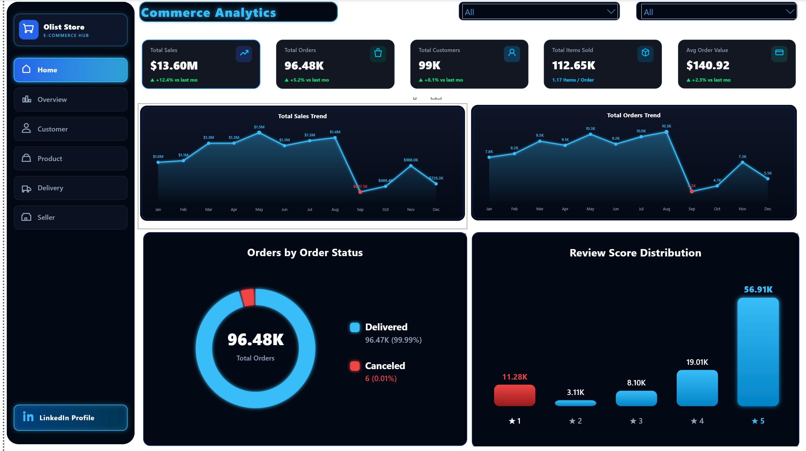
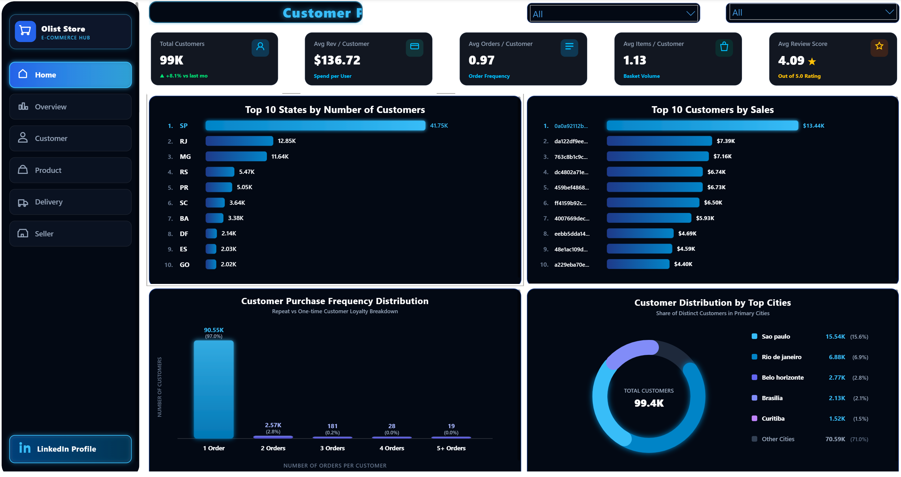
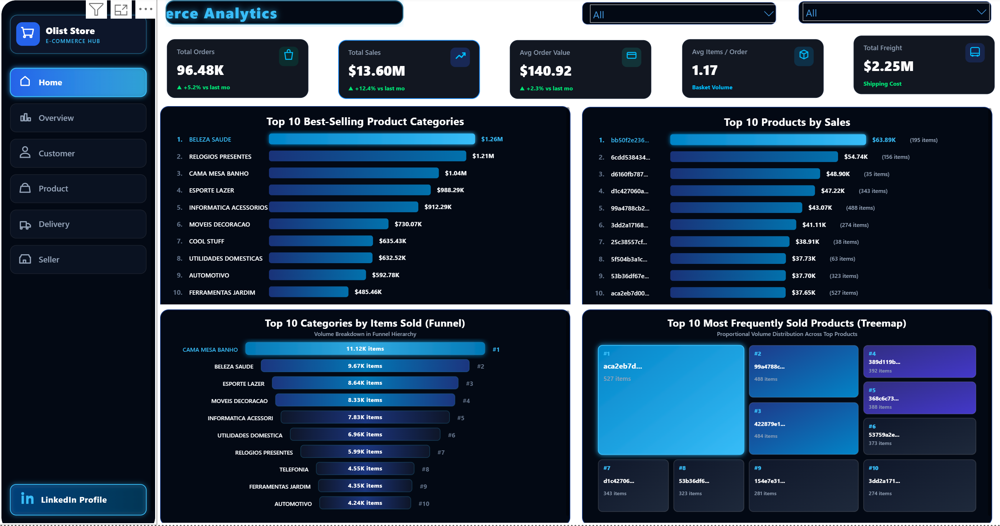
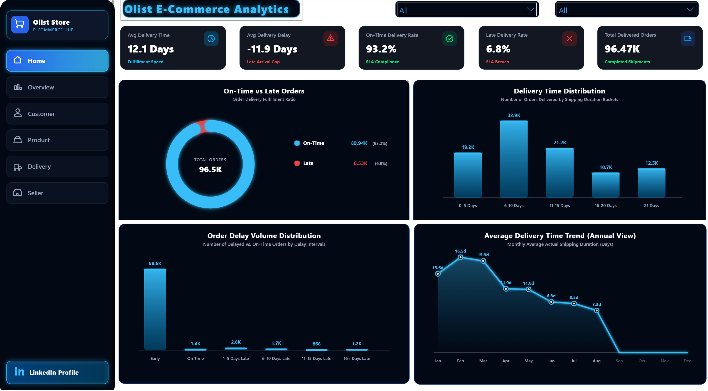
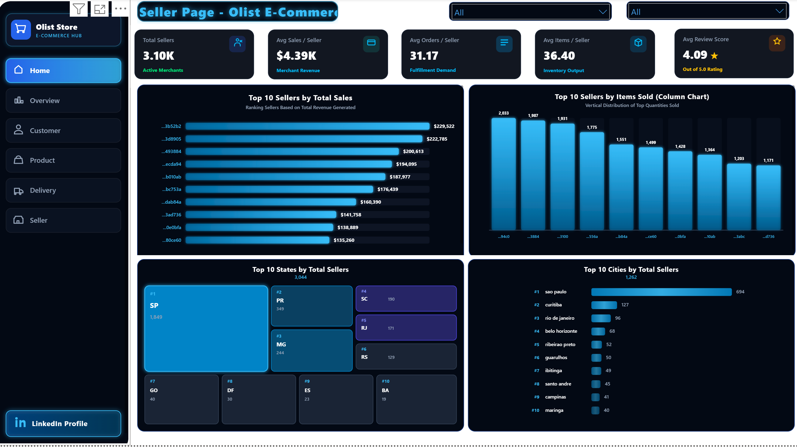

# 📊 Olist E-Commerce Analytics Hub

An end-to-end data analytics project examining Brazilian E-Commerce public data (Olist) to extract actionable business insights across sales performance, customer logistics, churn rate, and merchant operations.

---

## 🛠️ Tech Stack & Tools
* **Database Management:** SQL Server (Data extraction, complex aggregation, CTEs)
* **Data Processing & Cleaning:** Python (Pandas, NumPy)
* **Data Visualization & Dashboarding:** Power BI (DAX, Data Modeling, Custom Layouts)

---

## 📸 Dashboards Overview

---

## 📄 Executive Business Recommendations | التوصيات التنفيذية للبزنس

### 1. Optimize Customer Retention & Lifecycle Strategy
* **Insight:** Customer churn is exceptionally high, with **90.55K customers (over 97%)** making only a single purchase and a repeat purchase rate of less than **3%**.
* **Action:** Shift marketing budget from pure acquisition to retention. Implement automated post-purchase email flows, targeted loyalty programs, and RFM-segmented re-engagement campaigns to incentivize second purchases and maximize Customer Lifetime Value (LTV).

> **الترجمة بالعربي:**
> * **الملاحظة:** نسبة تسرب العملاء (Churn) مرتفعة جداً، حيث إن **90.55 ألف عميل (أكثر من 97%)** اشتروا مرة واحدة فقط، ونسبة الشراء المكرر أقل من **3%**.
> * **التوصية:** توجيه جزء من ميزانية التسويق من جلب عملاء جُدد إلى الاحتفاظ بالعملاء الحاليين (Retention). تفعيل حملات بريدية تلقائية بعد الشراء، وبرامج ولاء، وحملات إعادة إشراك بالاعتماد على تحليل RFM لتحفيز عملية الشراء الثانية وزيادة القيمة الممتدة للعميل (LTV).

---

### 2. Streamline Delivery Logistics & SLA Compliance
* **Insight:** Average fulfillment duration stands at **12.1 days**, with **6.8% of total orders (6.53K orders) experiencing delivery delays**, reaching up to 16+ days late.
* **Action:** Establish regional fulfillment centers closer to high-density demand hubs like **São Paulo (15.54K customers)** to slash transit times to under 5 days. Introduce stricter SLA enforcement policies and seller accountability measures for dispatch delays.

> **الترجمة بالعربي:**
> * **الملاحظة:** متوسط وقت تنفيذ وشحن الطلب يستغرق **12.1 يومًا**، مع وجود **6.8% من إجمالي الطلبات (6.53 ألف طلب) تعاني من التأخير**، وتصل بعض التأخيرات إلى أكثر من 16 يومًا.
> * **التوصية:** إنشاء مراكز توزيع إقليمية (Fulfillment Centers) بالقرب من المناطق ذات الطلب العالي مثل **ساو باولو (15.54 ألف عميل)** لتقليل زمن الشحن إلى أقل من 5 أيام. تطبيق سياسات صارمة لاتفاقيات مستوى الخدمة (SLA) ومحاسبة البائعين المتسببين في تأخير تجهيز الشحنات.

---

### 3. Capitalize on Core Categories & Strategic Seller Expansion
* **Insight:** Sales volume is heavily concentrated in key categories such as `BELEZA SAUDE` and `CAMA MESA BANHO`, while merchant distribution remains highly localized across 3.10K active sellers.
* **Action:** Double down on inventory availability and promotion strategies for top-performing categories. Actively recruit and onboard sellers in high-demand geographical zones to reduce cross-state shipping costs and delivery bottlenecks.

> **الترجمة بالعربي:**
> * **الملاحظة:** حجم المبيعات يتركز بشكل كبير في قطاعات رئيسية مثل (الصحة والجمال) و(أثاث ومستلزمات المنزل)، بينما يتوزع 3.10 ألف بائع نشط بشكل محلي فقط.
> * **التوصية:** التركيز على توفير المخزون واستراتيجيات الترويج للأقسام الأكثر مبيعاً ونشاطاً. العمل على جذب وبناء شراكات مع بائعين جُدد في المناطق الجغرافية ذات الطلب العالي لتقليل تكاليف الشحن بين الولايات وتفادي اختناقات التوصيل.

---

### 4. Resolve Service Friction & Address 1-Star Feedback
* **Insight:** A significant portion of feedback falls into low satisfaction tiers, including **11.28K 1-star reviews**, despite a strong overall rating average of 4.09.
* **Action:** Conduct targeted natural language processing (NLP) and sentiment analysis on negative customer reviews to isolate root causes (e.g., product quality vs. shipping delay). Implement an automated alert system for poor ratings to enable rapid customer service intervention.

> **الترجمة بالعربي:**
> * **الملاحظة:** هناك جزء غير هين من التقييمات يقع في فئات الرضا المنخفضة، بما في ذلك **11.28 ألف تقييم بنجمة واحدة**، على الرغم من أن متوسط التقييم العام جيد ويبلغ 4.09.
> * **التوصية:** إجراء تحليل لمشاعر العملاء (Sentiment Analysis) وتخليص النصوص من المراجعات السلبية لمعرفة السبب الرئيسي (مثل: جودة المنتج مقابل تأخير الشحن). إنشاء نظام تنبيهات آلي للتقييمات الضعيفة لتمكين فريق خدمة العملاء من التدخل والسعي لحل المشكلة فوراً.
